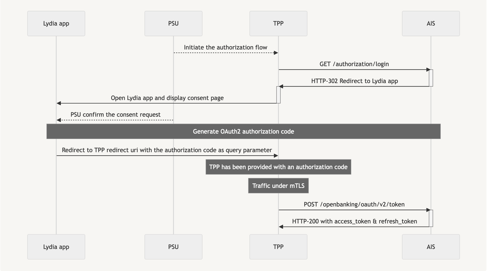

# USE LYDIA’S PSD2 AIS APIs

Third Party Providers can consume the PSD2 AISP API to retrieve the following predefined set of data from an account if it was granted by the customer :
- balance
- and/or transactions history + details if available
- account owner and people with power of attorney

Our API allows TPPs to access Account information on behalf of Lydia users. This API provides an interface between Lydia as Account Servicing Payment Service Provider (ASPSP) and Third Party (Payment Service) Providers (TPP).

To access our AISP API, TPP should act with the Account Information Service Provider (AISP) role. 
And the Payment Service User (PSU), owner of the accounts held by Lydia, should give accreditations to the TPP in order to access his accounts information.

The access to AIS API features is granted by Lydia with an authorization token (or access token) issued using OAUTH2 standardized process.

The API is designed on a REST FULL model using JSON Structures. Our API is based on STET (1.6.3) format.
For complete endpoint description, please refer to the [openapi](./assets/openapi.yaml) file.

## PSU consent
Lydia chose the Mixed Model so Lydia requires the formal consent of the PSU.

TPP is communicating to Lydia his clientID as TPP and the redirect URI of the TPP.
Lydia is displaying a consent page to obtain the customer agreement to share all the predefined data for all his current account opened in Lydia with a dedicated TPP.
Lydia will record this “consent” for a given PSU + given TPP AISP + all pre-defined data + all his payment account.

Note that we only provide PSU consent from the Lydia mobile application.

### Prerequisites
- TPP has an agreement for the AISP role from any european competent authority
- TPP and PSU have service contract
- TPP and Lydia have been performed a mutual authentication
- TPP has delivered his OAUTH2 access token to be able to consume the API resources

### AIS authorization flow
> OAuth flow to retrieve an access token to act on behalf of the PSU<br>


#### PSU consent page redirection
> Request
```
GET https://lydia-app.com/site/open/dispatch/openauth
    ?client_id=65904271c7f48ee638a684f55f76a92a1c7ecc7a0c56e5c0a1b83e2510efcb4d
    &redirect_uri=https%3A%2F%2Ftpp.com
    &state=123456
    &scope=aisp
```
Notes:
- Client id has been provided to you by Lydia during your onboarding.
- Redirect URI must have been registered during your onboarding.
- If provided, `state` will be forwarded to you as query parameter of you redirect uri.
- You can ask for more scopes in the same request, refer to the OpenAPI documentation.
> Response
```
HTTP/2 302
location location: lydia-deeplink://openauth
    ?client_id=65904271c7f48ee638a684f55f76a92a1c7ecc7a0c56e5c0a1b83e2510efcb4d
    &redirect_uri=https%3A%2F%2Ftpp.com
    &scope=aisp
    &state=123456
```
Notes:
- At this point the PSU has been redirected to its Lydia mobile app to confirm or deny his consent
- Denying a consent doesn't redirect the PSU to the TPP redirect uri
- Confirming a consent redirect the PSU to the TPP redirect uri
- The authorization code sent as query parameter of the TPP redirect uri is valid for 10 minutes

#### Oauth2 Authorization code
> Request
```
POST https://openbanking.lydia-app.com:8082/openbanking/oauth/v2/token
Content-Type: application/x-www-form-urlencoded

grant_type=authorization_code
client_id={{client_id}}
client_secret={{client_secret}}
code={{authorization_code}}
```
Notes:
- You must provide your QWAC certificate to ensure mTLS handshake.
- The access token is valid for one hour.
- Client id and secret have been provided to you by Lydia during your onboarding.
  
> Response
```
HTTP/2 200
{
    "access_token": "access_token",
    "refresh_token": "refresh_token",
    "expires_in": 3600,
    "scope": "aisp",
}
```

### Retrieval of the PSU accounts 
TPP is interacting with the customer through its interfaces. TPP sends a GET request to Lydia infrastructure to get this list of payment accounts which returns the accounts and balance, and the details of the account owner and attorney (if there is).
If the PSU has several payment accounts opened, Lydia will communicate the BIC, IBAN, account name and current balance of all the accounts.

Service returns all accounts on which the user has spending rights of type enveloppe, group, collect, etc. but not savings, trading, etc.

Prerequisites
- PSU gave his consent to Lydia for sharing data.
> Request
```
GET https://openbanking.lydia-app.com:8083/aisp/accounts
Authorization: Bearer {{access_token}}
```
> Response
```
HTTP/2 200
{
    "accounts": [
        {
            "resourceId": "35553",
            "bicFi": "LYDIFRP2XXX",
            "accountId": {
                "iban": "FR7617598000010000003555363",
                "currency": "EUR"
            },
            "name": "Main account",
            "usage": "PRIV",
            "cashAccountType": "CACC",
            "psuStatus": "Account Holder",
            "balances": [
                {
                    "balanceAmount": {
                        "amount": 22054.54,
                        "currency": "EUR"
                    },
                    "balanceType": "XPCD"
                }
            ]
        },
        ...
    ],
    "_links": {
        "self": {
            "href": "/aisp/accounts"
        }
    }
}
```

### Retrieval of account owner
This call allows to get the connected customer identity. Only the identity of the owner of the account will be communicated, not the people with power of attorney.
Lydia is communicating the fullname, lastname and firstname of the account owner.

Prerequisites
PSU gave his consent to Lydia for sharing data.

> Request
```
GET https://openbanking.lydia-app.com:8083/aisp/end-user-identity
Authorization: Bearer {{access_token}}
```
> Response
```
HTTP/2 200
{
    "identity": [
        {
            "fullName": "John Doe",
            "firstName": "John",
            "lastName": "Doe"
        }
    ],
    "_links": {
        "self": {
            "href": "/aisp/end-user-identity"
        }
    }
}
```

### Retrieval of transactions

This call allows the TPP to get the history of transactions for a payment account. 
Lydia is displaying the list of transactions booked on the account requested.
If a TPP is requesting to apply a specific date range, only the transactions requested will be displayed.
Lydia is communicating for each transaction the amount, currency, the indicator if the transaction is a debit or a credit, the status, the date of the transaction and the end to end reference. 
Note: The list of transactions is the same as the list displayed in the mobile application of the user, which means that a transaction can be cancelled without generating a new transaction but only an update of the previous transaction.

Prerequisites
- PSU gave his consent to Lydia for sharing data.

> Request
```
GET https://openbanking.lydia-app.com:8083/aisp/accounts/{{account.resourceId}}/transactions?size=50&page=1
Authorization: Bearer {{access_token}}
```
Notes:
- Placeholder account.resourceId match a resourceId inside the response of `Retrieval of the PSU accounts` request
- Size query parameter is optional, default value 50, maximum value 500
- Page query parameter is optional, default value 0

> Response
```
HTTP/2 200
{
    "transactions": [
        {
            "resourceId": "20086d7f-349e-3a51-1dbf-b5827170e8f8",
            "transactionAmount": {
                "amount": -1,
                "currency": "EUR"
            },
            "creditDebitIndicator": "DBIT",
            "status": "BOOK",
            "transactionDate": "2024-02-29T15:38:44Z",
            "bookingDate": "2024-02-29T15:38:44Z",
            "endToEndId": "transaction-20086d7f-349e-3a51-1dbf-b5827170e8f8",
            "remittanceInformation": {
                "structured": [
                    {
                        "referredDocumentInformation": {
                            "lineDetails": [
                                {
                                    "description": "Instant transfer"
                                }
                            ]
                        }
                    }
                ],
                "unstructured": [
                    "Instant transfer"
                ]
            },
            "bankTransactionCode": {
                "family": "RCDT",
                "subFamily": "OTHR",
                "domain": "PMNT"
            }
        },
        ...
    ],
    "_links": {
        "next": {
            "href": "/aisp/accounts/{{account.resourceId}}/transactions?page=2&size=50"
        },
        "prev": {
            "href": "/aisp/accounts/{{account.resourceId}}/transactions?page=0&size=50"
        },
        "self": {
            "href": "/aisp/accounts/{{account.resourceId}}/transactions?page=1&size=50"
        }
    }
}
```
Notes:
- A given transaction can be updated by our system over the time, in case of refund by example
- Remittance information contains only the label of the transaction in structured and unstructured format
- Size in links copy the size query parameter in the request
- Date filters are described in the openapi.yaml file
