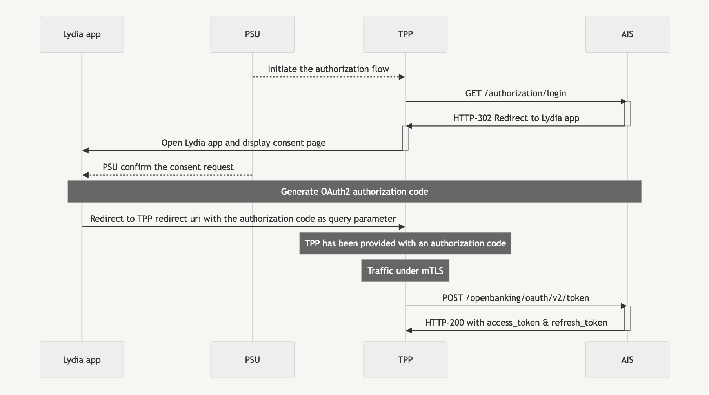

# USE LYDIA’S PSD2 CBPII APIs

As a Third Party Provider (TPP), you delivered to a customer a private labeled payment card linked to his bank account. The customer (PSU) is performing a transaction on an e-commerce site with it. The customer has previously given consent to your entity as well as to his bank account holder.
Using API "CPBII" setup by banks (ASPSP), you can request for real-time transaction amount coverage data authorized by the customer without asking for online banking credentials. You can then reduce your risk for overdue payments.
The bank will respond yes or no without any funds blockage corresponding to the transaction amount, neither any validation of this transaction.

To access our CBPII API, TPP should act with the Card Based Payment Instrument Issuer (CBPII) role.

And the Payment Service User (PSU), owner of the accounts held by Lydia, should give accreditations to the TPP in order to receive a confirmation of funds availability on the PSU account.

## PSU consent
Lydia chose the Mixed Model so Lydia requires the formal consent of the PSU. 
The API is designed on a REST FULL model using JSON Structures. Our API is based on STET (1.6.3) format.
Lydia will identify and authorize the customer using the "redirect" mode in order to issue the tokens.

### Prerequisites
- TPP has an agreement for the AISP role from any european competent authority
- TPP and PSU have service contract
- TPP and Lydia have been performed a mutual authentication
- TPP has delivered his OAUTH2 access token to be able to consume the API resources

### CBPII authorization flow
> OAuth flow to retrieve an access token to act on behalf of the PSU<br>


#### PSU consent page redirection
> Request
```
GET https://openauth.lydia-app.com/authorization/login
    ?client_id=65904271c7f48ee638a684f55f76a92a1c7ecc7a0c56e5c0a1b83e2510efcb4d
    &redirect_uri=https%3A%2F%2Ftpp.com
    &state=123456
    &scope=cbpii
```
Notes:
- Client id has been provided to you by Lydia during your onboarding.
- Redirect URI must have been registered during your onboarding.
- If provided, `state` will be forwarded to you as query parameter of you redirect uri.
- You can ask for more scopes in the same request, refer to the OpenAPI documentation.
> Response
```
HTTP/2 302
location location: com.lydia-app://openauth
    ?client_id=65904271c7f48ee638a684f55f76a92a1c7ecc7a0c56e5c0a1b83e2510efcb4d
    &redirect_uri=https%3A%2F%2Ftpp.com
    &scope=cbpii
    &state=123456
```
Notes:
- At this point the PSU has been redirected to its Lydia mobile app to confirm or deny his consent
- Denying a consent doesn't redirect the PSU to the TPP redirect uri
- Confirming a consent redirect the PSU to the TPP redirect uri
- The authorization sent as query parameter of the TPP redirect uri is valid for 10 minutes

#### Oauth2 Authorization code
> Request
```
POST https://openbanking.lydia-app.com:8082/openbanking/oauth/v2/token
Content-Type: x-www-form-urlencoded

grant_type=authorization_code
client_id=65904271c7f48ee638a684f55f76a92a1c7ecc7a0c56e5c0a1b83e2510efcb4d
client_secret=83d151a98eac0d0cd336a12859ee555ca1c07ecbc7e5a79fe1fba23098d38ea7
code={{authorization_code}}
```
Notes:
- You must provide your QWAC certificate to ensure mTLS handshake.
- The access token is valid for one hour.
- Client id and secret have been provided to you by Lydia during your onboarding.
  
> Response
```
HTTP/2 200
{
    "access_token": "access_token",
    "refresh_token": "refresh_token",
    "expires_in": 3600,
    "scope": "cbpii",
}
```

### PSU account funds confirmation

> Request
```
POST 
Authorization: Bearer {{access_token}}
Content-Type: application/json

{
    "paymentCoverageRequestId": "req_id",
    "instructedAmount": {
        "amount": 10,
        "currency": "EUR"
    },
    "accountId": {
        "Iban": "{{iban}}"
    }
}
```
Notes:
- All amounts are in euro.
- There will be no reservations of funds
> Response
```
HTTT/2 200
{
    "request": {
        "paymentCoverageRequestId": "req_id",
        "instructedAmount": {
            "amount": 10,
            "currency": "EUR"
        },
        "accountId": {
            "other": {
                "iban": "FR7617598000010000003555363"
            }
        }
    },
    "result": true,
    "_links": {
        "self": {
            "href": "/cbpii/funds-confirmations"
        }
    }
}
```
